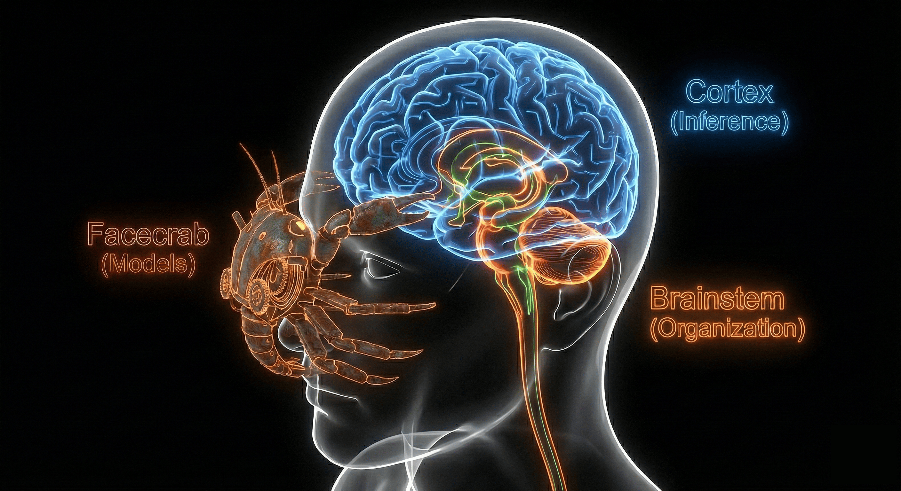
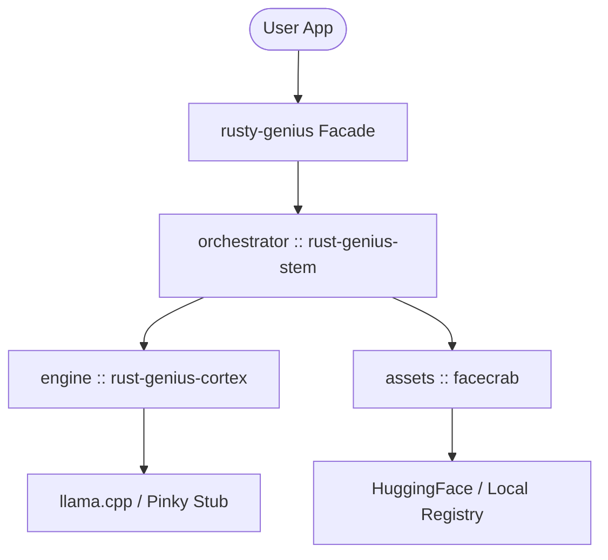
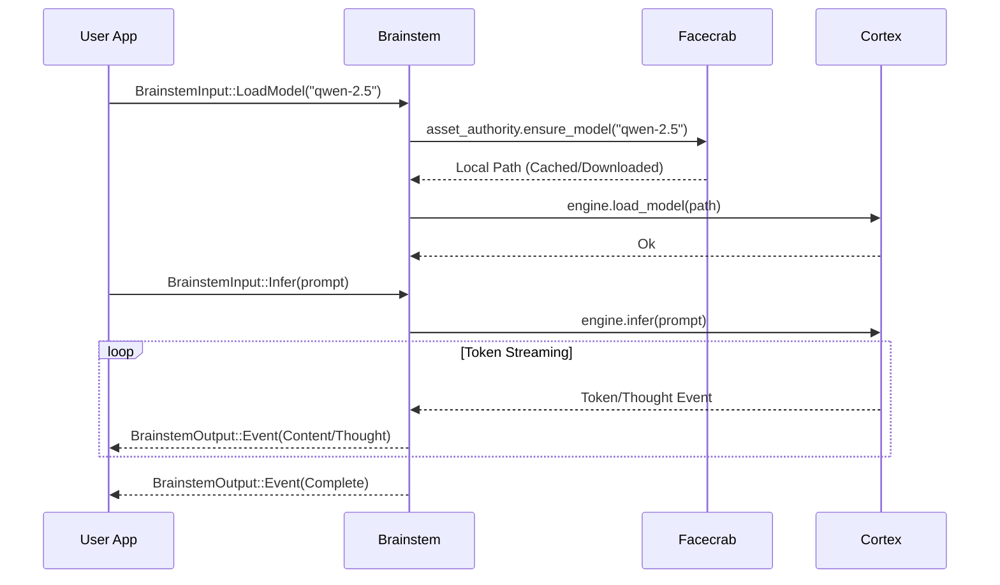
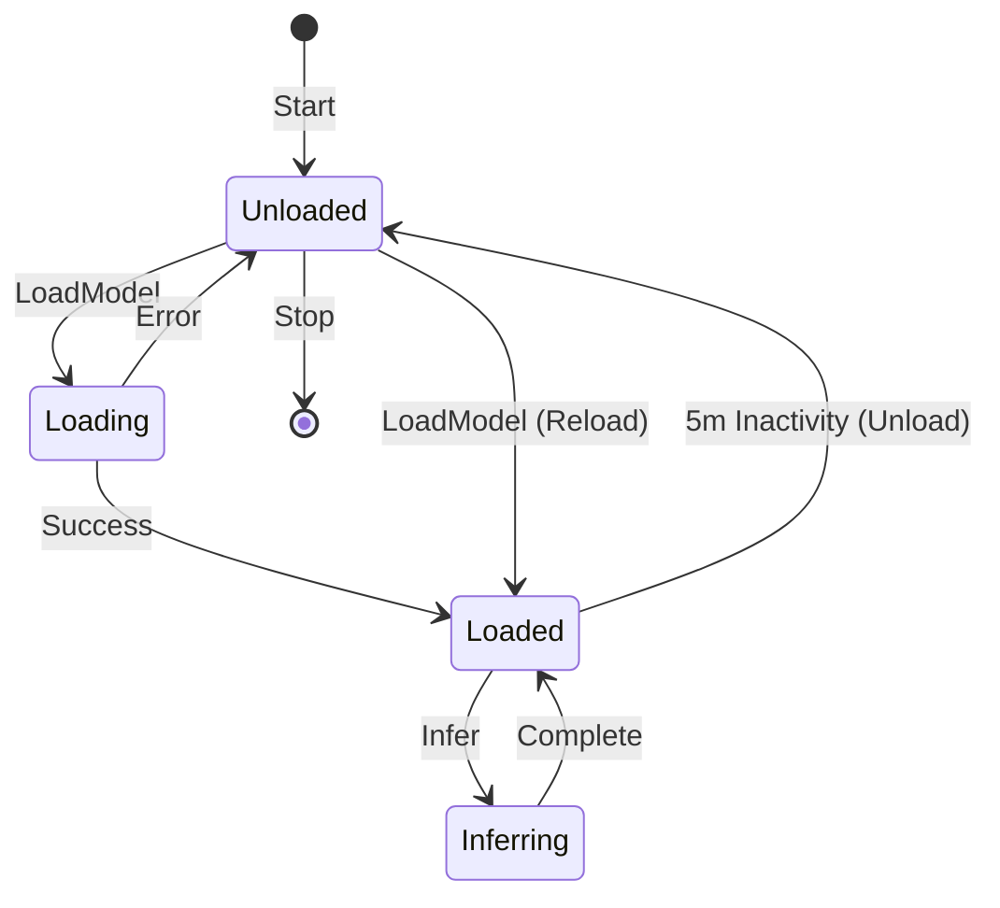

# rusty-genius

[](https://crates.io/crates/rusty-genius)
[](https://opensource.org/licenses/MIT)
[](https://async.rs/)
[](https://crates.io/crates/llama-cpp-2)
[](https://tmzt.github.io/rusty-genius/)

**The Nervous System for AI.** A high-performance, modular, local-first AI orchestration library written in Rust.

## Overview

Rusty-Genius is built for **on-device orchestration**, prioritizing absolute privacy, zero latency, and offline reliability. It decouples protocol, orchestration, engine, and tooling to provide a flexible foundation for modern AI applications.



## Architecture

The project follows a biological metaphor, where each component serves a specific function in the "nervous system":

### Public Crates

- **Genius (`rusty-genius`)**: The Public Facade. Re-exports internal crates and provides the primary user API.

### Internal Crates

- **Brainstem (`rusty-genius-stem`)**: The Orchestrator. Manages the central event loop, engine lifecycle (TTL), and state transitions.
- **Cortex (`rusty-genius-cortex`)**: The Muscle. Provides direct bindings to `llama.cpp` for inference, handling KV caching and token streaming.
- **Core (`rusty-genius-core`)**: The Shared Vocabulary. Contains protocol enums, manifests, and error definitions with zero internal dependencies.
- **Teaser (`rusty-genius-teaser`)**: The QA Harness. Provides integration testing via file-system fixtures.

### Global Architecture



### Integration Crates

- **Facecrab (`facecrab`)**: The Supplier. An autonomous asset authority that handles model resolution (HuggingFace), registry management, and downloads.

This crate is also usable as an independent crate. It provides a simple interface for downloading and managing models directly via `async fn` calls or a higher-level asynchronous event interface:

```rust
use facecrab::AssetAuthority;

#[async_std::main]
async fn main() -> Result<(), Box<dyn std::error::Error>> {
    let authority = AssetAuthority::new()?;
    // Resolves registry names or direct HF IDs, downloads to local cache automatically
    let model_path = authority.ensure_model("qwen-2.5-3b-instruct").await?;
    println!("Model ready at: {:?}", model_path);
    Ok(())
}
```

## Features

- **Local-First**: No data leaves your machine. No API keys or subscriptions required for core inference.
- **Modular Design**: Swap or stub components (like the "Pinky" engine stub) for testing and development.
- **High Performance**: Native hardware acceleration via Metal (macOS), CUDA (Linux/Windows), and Vulkan.
- **Async Architecture**: Built on `async-std` and `surf` for efficient, non-blocking I/O.

## Installation

Add `rusty-genius` to your `Cargo.toml`:

```toml
[dependencies]
rusty-genius = { version = "0.1.1", features = ["metal"] }
```

### Hardware Acceleration

Enable the appropriate feature for your hardware:
- **Metal**: `features = ["metal"]` (macOS Apple Silicon/Intel)
- **CUDA**: `features = ["cuda"]` (NVIDIA GPUs)
- **Vulkan**: `features = ["vulkan"]` (Generic/Intel GPUs)

## Usage Methods

### 1. Unified Orchestration (Recommended)

The most robust way to use Rusty-Genius is via the `Orchestrator`. It manages the background event loop, model lifecycle (loading/unloading), and hardware stubs.

#### Lifecycle & Inference Flow



#### Engine Lifecycle & TTL

The `Orchestrator` implements a `CortexStrategy` to manage the inference engine's memory footprint. By default, it will hibernate (unload) the model after 5 minutes of inactivity.



#### Full Implementation Example

```rust
use rusty_genius::Orchestrator;
use rusty_genius::core::protocol::{BrainstemInput, BrainstemOutput, InferenceEvent};
use futures::{StreamExt, sink::SinkExt, channel::mpsc};

#[async_std::main]
async fn main() -> Result<(), Box<dyn std::error::Error>> {
    // 1. Initialize the orchestrator (with default 5m TTL)
    let mut genius = Orchestrator::new().await?;
    let (mut input, rx) = mpsc::channel(100);
    let (tx, mut output) = mpsc::channel(100);

    // Spawn the Brainstem event loop
    async_std::task::spawn(async move { genius.run(rx, tx).await });

    // 2. Load a model (downloads from HuggingFace if not cached)
    input.send(BrainstemInput::LoadModel(
        "qwen-2.5-3b-instruct".into()
    )).await?;

    // 3. Submit a prompt
    input.send(BrainstemInput::Infer {
        prompt: "Explain Rust in one sentence.".into(),
        config: Default::default(),
    }).await?;

    // 4. Stream results
    while let Some(BrainstemOutput::Event(e)) = output.next().await {
        match e {
            InferenceEvent::Content(c) => print!("{}", c),
            InferenceEvent::Complete => break,
            _ => {}
        }
    }

    Ok(())
}
```

### 2. Standalone Asset Management

If you only need a high-performance downloader for GGUF/LLM assets with a local registry, you can use `facecrab` directly as shown in the [Integration Crates](#integration-crates) section.

## OS Prerequisites

### macOS
- Install Command Line Tools: `xcode-select --install`
- Install CMake: `brew install cmake`

### Linux
- Build Essentials: `apt install build-essential cmake libclang-dev`
- CPU/GPU specific headers (CUDA Toolkit, etc.)

### Windows
- Visual Studio 2022 (C++ Workload)
- CMake
- `LIBCLANG_PATH` set in system environment

## Technical Note

> [!IMPORTANT]
> **Cargo.lock** is tracked in this repository to ensure development stability and reproducible builds across the workspace. If you are a library consumer, please note that `Cargo.lock` is ignored when publishing to crates.io.

## License

Released under the [MIT License](./LICENSE). Usage with dependencies may be subject to the licenses of those dependencies. Contents of `./site/assets/images` are generated with Nano Banana Pro. Copyright (c) 2026 Timothy Meade.
