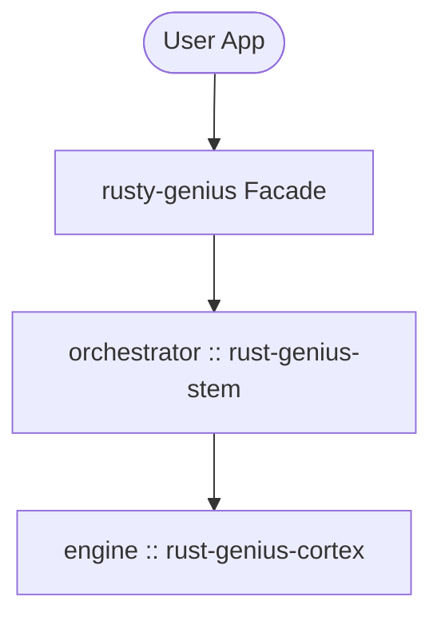

# rusty-genius

[](https://crates.io/crates/rusty-genius)
[](https://opensource.org/licenses/MIT)
[](https://async.rs/)
[](https://crates.io/crates/llama-cpp-2)
[](https://tmzt.github.io/rusty-genius/)

**The Nervous System for AI.** A high-performance, modular, local-first AI orchestration library written in Rust.

## Overview

Rusty-Genius is built for **on-device orchestration**, prioritizing absolute privacy, zero latency, and offline reliability. It decouples protocol, orchestration, engine, and tooling to provide a flexible foundation for modern AI applications.


## Architecture

The project follows a biological metaphor, where each component serves a specific function in the "nervous system":

### Public Crates

- **Genius (`rusty-genius`)**: The Public Facade. Re-exports internal crates and provides the primary user API.

### Internal Crates

- **Brainstem (`rusty-genius-stem`)**: The Orchestrator. Manages the central event loop, engine lifecycle (TTL), and state transitions.
- **Cortex (`rusty-genius-cortex`)**: The Muscle. Provides direct bindings to `llama.cpp` for inference, handling KV caching and token streaming.
- **Core (`rusty-genius-core`)**: The Shared Vocabulary. Contains protocol enums, manifests, and error definitions with zero internal dependencies.
- **Teaser (`rusty-genius-teaser`)**: The QA Harness. Provides integration testing via file-system fixtures.

### Global Architecture



## Command Line Usage

The `ogenius` CLI provides an interactive chat REPL and an OpenAI-compatible API server, with automatic model downloading from Huggingface.

See the [API Reference](crates/ogenius/docs/API.md) for details on how to use it from code.

**Quick Install:**
```bash
# Standard install (CPU only)
cargo install ogenius

# Install with Metal (macOS)
brew install cmake
cargo install ogenius --features metal

# Install with CUDA (cross-platform)
cargo install ogenius --features cuda

# Install with Vulkan (cross-platform)
cargo install ogenius --features vulkan
```

**Basic Usage:**
```bash
# Download a model
ogenius download Qwen/Qwen2.5-1.5B-Instruct

# Start interactive chat
ogenius chat --model Qwen/Qwen2.5-1.5B-Instruct

# Run the API & Web Server (defaults to port 8080)
ogenius serve --model Qwen/Qwen2.5-1.5B-Instruct
```

## Library Usage

Add `rusty-genius` to your `Cargo.toml`:

```toml
[dependencies]
rusty-genius = { version = "0.1.2", features = ["metal"] }
```

or use

```bash
cargo add rusty-genius --features metal
```

### Hardware Acceleration

Enable the appropriate feature for your hardware:
- **Metal**: `features = ["metal"]` (macOS Apple Silicon/Intel)
- **CUDA**: `features = ["cuda"]` (NVIDIA GPUs)
- **Vulkan**: `features = ["vulkan"]` (Generic/Intel GPUs)

## Configuration

Rusty-Genius can be configured via environment variables and manifest files.

### Environment Variables

| Variable | Description | Default |
|----------|-------------|---------|
| `GENIUS_HOME` | Primary directory for configuration and the static manifest. | `~/.config/rusty-genius` |
| `GENIUS_CACHE` | Directory for downloaded model assets and the dynamic registry. | `$GENIUS_HOME/cache` |

### Configuration Files

The system uses two types of configuration files to manage model awareness:

1.  **`manifest.toml`** (Config Directory): A static, user-editable file used to extend the built-in model list. Use this to "inject" your own GGUF models.
2.  **`registry.toml`** (Cache Directory): A dynamically updated index maintained by the system. When you use `ogenius download <repo>`, the model details are automatically recorded here.

**Example `manifest.toml`:**
Location: `~/.config/rusty-genius/manifest.toml`

```toml
[[models]]
name = "my-custom-model"
repo = "TheBloke/Llama-2-7B-Chat-GGUF"
filename = "llama-2-7b-chat.Q4_K_M.gguf"
quantization = "Q4_K_M"
```

Once defined, your model is available by name:
```bash
ogenius chat --model my-custom-model
```

## Try It Out

You can run the included examples to test the system immediately. Ensure you have the [prerequisites](#os-prerequisites) installed.

### 1. Test Asset Downloader
Verify that `facecrab` can resolve and download models from HuggingFace:
```bash
cargo run -p facecrab --example downloader
```

### 2. Test Local Inference
Run a full chat loop using the `real-engine` (requires `llama.cpp` to build). 

**CPU (Generic):**
```bash
cargo run -p rusty-genius --example basic_chat --features real-engine
```

**GPU (macOS / Metal):**
```bash
cargo run -p rusty-genius --example basic_chat --features metal
```

**GPU (NVIDIA / CUDA):**
```bash
cargo run -p rusty-genius --example basic_chat --features cuda
```

## Usage Methods

### 1. Unified Orchestration (Recommended)

The most robust way to use Rusty-Genius is via the `Orchestrator`. It manages the background event loop, model lifecycle (loading/unloading), and hardware stubs.

#### Lifecycle & Inference Flow


#### Engine Lifecycle & TTL

The `Orchestrator` implements a `CortexStrategy` to manage the inference engine's memory footprint. By default, it will hibernate (unload) the model after 5 minutes of inactivity.


#### Full Implementation Example

```rust
use rusty_genius::Orchestrator;
use rusty_genius::core::protocol::{AssetEvent, BrainstemInput, BrainstemOutput, InferenceEvent};
use futures::{StreamExt, sink::SinkExt, channel::mpsc};

#[async_std::main]
async fn main() -> Result<(), Box<dyn std::error::Error>> {
    // 1. Initialize the orchestrator (with default 5m TTL)
    let mut genius = Orchestrator::new().await?;
    let (mut input, rx) = mpsc::channel(100);
    let (tx, mut output) = mpsc::channel(100);

    // Spawn the Brainstem event loop
    async_std::task::spawn(async move { 
        if let Err(e) = genius.run(rx, tx).await {
            eprintln!("Orchestrator error: {}", e);
        }
    });

    // 2. Load a model (downloads from HuggingFace if not cached)
    input.send(BrainstemInput::LoadModel(
        "tiny-model".into()
    )).await?;

    // 3. Submit a prompt
    input.send(BrainstemInput::Infer {
        prompt: "Once upon a time, in the world of systems programming...".into(),
        config: Default::default(),
    }).await?;

    // 4. Stream results
    println!("--- Response ---");
    while let Some(msg) = output.next().await {
        match msg {
            BrainstemOutput::Asset(a) => match a {
                AssetEvent::Started(s) => println!("[Asset] Starting: {}", s),
                AssetEvent::Complete(path) => println!("[Asset] Ready at: {}", path),
                AssetEvent::Error(e) => eprintln!("[Asset] Error: {}", e),
                _ => {} // Handle progress if desired
            },
            BrainstemOutput::Event(e) => match e {
                InferenceEvent::Content(c) => print!("{}", c),
                InferenceEvent::Complete => {
                    println!("\n--- Complete ---");
                    break;
                }
                _ => {}
            },
            BrainstemOutput::Error(err) => {
                eprintln!("\nBrainstem Error: {}", err);
                break;
            }
        }
    }

    Ok(())
}
```

## Integration Crates

### 1. Facecrab (`facecrab`)

The Supplier. An autonomous asset authority that handles model resolution (HuggingFace), registry management, and downloads.

This crate is also usable as an independent crate. It provides a simple interface for downloading and managing models directly via `async fn` calls or a higher-level asynchronous event interface:

```rust
use facecrab::AssetAuthority;

#[async_std::main]
async fn main() -> Result<(), Box<dyn std::error::Error>> {
    let authority = AssetAuthority::new()?;
    
    // Resolves registry names or direct HF IDs, downloads to local cache automatically
    // Returns the absolute file path on success
    let model_path = authority.ensure_model("tiny-model").await?;
    println!("Model ready at: {:?}", model_path);
    Ok(())
}
```

## OS Prerequisites

### macOS
- Install Command Line Tools: `xcode-select --install`
- Install CMake: `brew install cmake`

### Linux
- Build Essentials: `apt install build-essential cmake libclang-dev`
- CPU/GPU specific headers (CUDA Toolkit, etc.)

### Windows
- Visual Studio 2022 (C++ Workload)
- CMake
- `LIBCLANG_PATH` set in system environment

## Technical Note

> [!IMPORTANT]
> **Cargo.lock** is tracked in this repository to ensure development stability and reproducible builds across the workspace. If you are a library consumer, please note that `Cargo.lock` is ignored when publishing to crates.io.

## License

Released under the [MIT License](./LICENSE). Usage with dependencies may be subject to the licenses of those dependencies. Contents of `./site/assets/images` are generated with Nano Banana Pro. Copyright (c) 2026 Timothy Meade.
